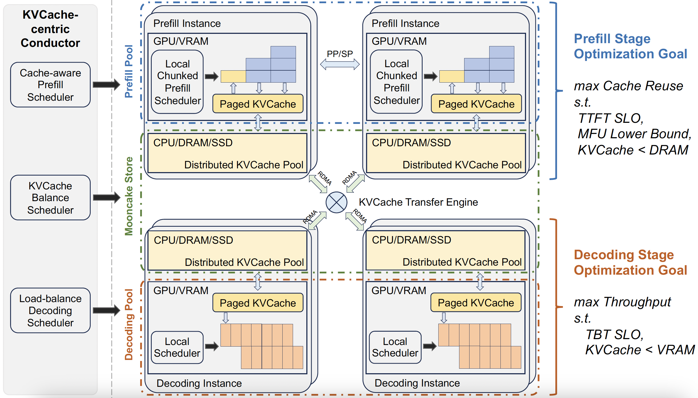

<div align="center">
  <h1>Mooncake: A KVCache-centric Disaggregated<br/> Architecture for LLM Serving</h1>
  <a href="Mooncake-v1.pdf" target="_blank"><strong>📃 Technical Report</strong></a>
</div>
<br/>

Mooncake is the serving platform for  <a href="https://kimi.ai/"> Kimi</a>, a leading LLM service provided by <a href="https://www.moonshot.cn/"> Moonshot AI</a>. 
This repository hosts its technical report and will also be utilized for the forthcoming open sourcing of traces. Stay tuned!

<h2 id="updates">🔥 Updates</h2>

 - **June 26, 2024**: Initial technical report release.


<h2 id="overview">🎉 Overview</h2>

Mooncake features a KVCache-centric disaggregated architecture that separates the prefill and decoding clusters. It also leverages the underutilized CPU, DRAM, and SSD resources of the GPU cluster to implement a disaggregated cache of KVCache. 



The core of Mooncake is its KVCache-centric scheduler, which balances maximizing overall effective throughput while meeting latency-related Service Level Objectives (SLOs) requirements. Unlike traditional studies that assume all requests will be processed, Mooncake faces challenges due to highly overloaded scenarios. To mitigate these, we developed a prediction-based early rejection policy. Experiments show that Mooncake excels in long-context scenarios. Compared to the baseline method, Mooncake can achieve up to a 525% increase in throughput in certain simulated scenarios while adhering to SLOs. Under real workloads, Mooncake’s innovative architecture enables <a href="https://kimi.ai/">Kimi</a> to handle 75% more requests.

<h2 id="citation">📑 Citation</h2>
Please kindly cite our paper if you find it is useful:

```bibtex
@article{qin2024mooncake,
  title        = {Mooncake: A KVCache-centric Disaggregated Architecture for LLM Serving},
  author       = {Ruoyu Qin, Zheming Li, Weiran He, Mingxing Zhang, Yongwei Wu, Weimin Zheng, and Xinran Xu},
  year         = {2024}
}
```

Remark: arXiv version is still on holding.
